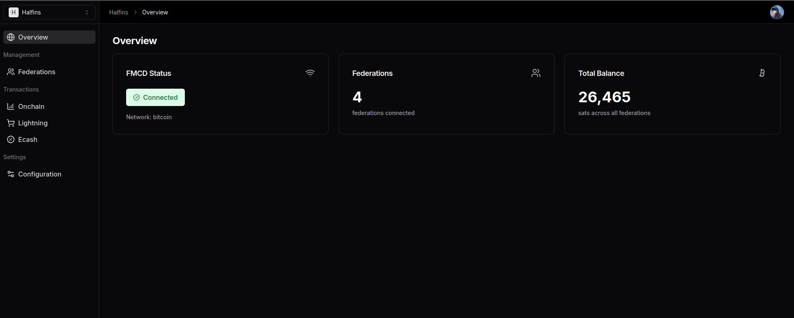

# FMCD Dashboard

A multi-tenant dashboard for [Fedimint Client Daemon (FMCD)](https://github.com/minmoto/fmcd) built with Next.js and [Stack Auth](https://github.com/stack-auth/stack). This dashboard enables teams to manage their FMCD instances, connect to federations, and monitor balances in a pivate, collaborative environment.

## Landing Page

<div align="center">

</div>

## Dashboard

<div align="center">

</div>

## Multi-tenancy (Teams)

<div align="center">

</div>

## Account Settings

<div align="center">

</div>

## Features

### FMCD Integration
- **Team-based FMCD Instances**: Each team can configure their own FMCD instance with secure credential storage
- **Federation Management**: Connect to federations using invite codes and view federation details
- **Real-time Balance Tracking**: Monitor Bitcoin balances across all connected federations
- **Admin Controls**: Team administrators manage FMCD instance configuration
- **Secure Communication**: All FMCD requests are proxied server-side with encrypted credentials

### Multi-tenancy
- **Team Management**: Create and manage multiple teams powered by [Stack Auth](https://github.com/stack-auth/stack)
- **Role-based Permissions**: Team admins can configure FMCD settings, all members can view data and connect federations
- **Team Isolation**: Each team's FMCD configuration and data is completely isolated

### Tech Stack
- Next.js 15 with App Router
- TypeScript with strict mode
- Tailwind CSS & Shadcn UI components
- [Stack Auth](https://github.com/stack-auth/stack) for authentication and team management
- [FMCD](https://github.com/minmoto/fmcd) integration for Bitcoin wallet functionality
- Dark mode support

## Getting Started

1. Clone the repository

   ```bash
   git clone https://github.com/minmoto/fmcdash.git
   cd fmcdash
   ```

2. Install dependencies

   ```bash
   npm install
   ```

3. Register an account on [Stack Auth](https://stack-auth.com), copy the keys from the dashboard, and paste them into the `.env.local` file. Then, enable "client team creation" on the team settings tab.

   If you want to learn more about Stack Auth or self-host it, check out the [Docs](https://docs.stack-auth.com) and [GitHub](https://github.com/stack-auth/stack).

4. Start the development server and go to [http://localhost:3030](http://localhost:3030)

   ```bash
   npm run dev
   ```

5. Configure FMCD instance for your team:
   - Create a team in the dashboard
   - Navigate to the Configuration page
   - Enter your FMCD instance URL (e.g., `http://localhost:3333`)
   - Enter the FMCD authentication password
   - Test the connection and save

## FMCD Configuration

### Prerequisites
- A running [FMCD](https://github.com/minmoto/fmcd) instance
- FMCD authentication password

### Setting up FMCD for a Team
1. Navigate to the team dashboard
2. Go to Configuration page (team admins only)
3. Enter FMCD Base URL (e.g., `http://localhost:3333` or `https://your-fmcd-instance.com`)
4. Enter FMCD authentication password
5. Click "Test Connection" to verify connectivity
6. Enable the integration and save

### Connecting to Federations
1. Navigate to the Federations page
2. Click "Connect Federation" button
3. Enter the federation invite code
4. Click "Connect" to join the federation
5. View federation details and balance in the dashboard

## Project Structure

- `app/` - Next.js App Router pages and API routes
- `components/` - Reusable React components including FMCD UI components
- `lib/` - Utility functions, types, and FMCD integration logic
- `app/api/team/[teamId]/fmcd/` - FMCD API proxy endpoints

## Related Projects

- [FMCD (Fedimint Client Daemon)](https://github.com/minmoto/fmcd) - The Bitcoin wallet client daemon this dashboard integrates with
- [Stack Auth](https://github.com/stack-auth/stack) - Open-source authentication and team management solution
- [Shadcn UI](https://github.com/shadcn-ui/ui) - Re-usable component library
- [Next.js](https://nextjs.org/) - React framework for production

## License

MIT
